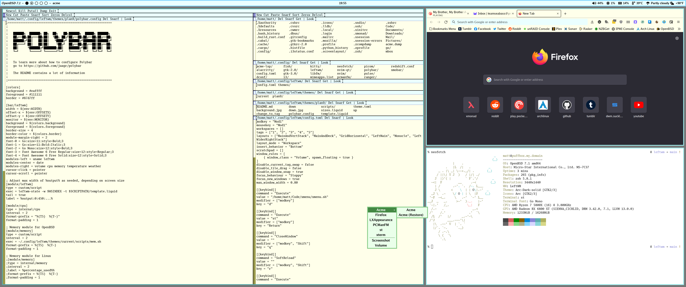

Based this off of the basic_polybar and the colors are taken from the [Plan 9 from Bell Labs](https://en.wikipedia.org/wiki/Plan_9_from_Bell_Labs) desktop

This theme makes use of following fonts:
* Go - https://go.dev/blog/go-fonts
* Font Awesome 6 Free - https://fontawesome.com/

Make sure you have them installed!

OpenBSD users: This theme requires features in Polybar that aren't available (as of writing this) in version in packages or ports. I have uploaded patches for building Polybar 3.6.3 https://github.com/seabassapologist/polybar-openbsd-patches
